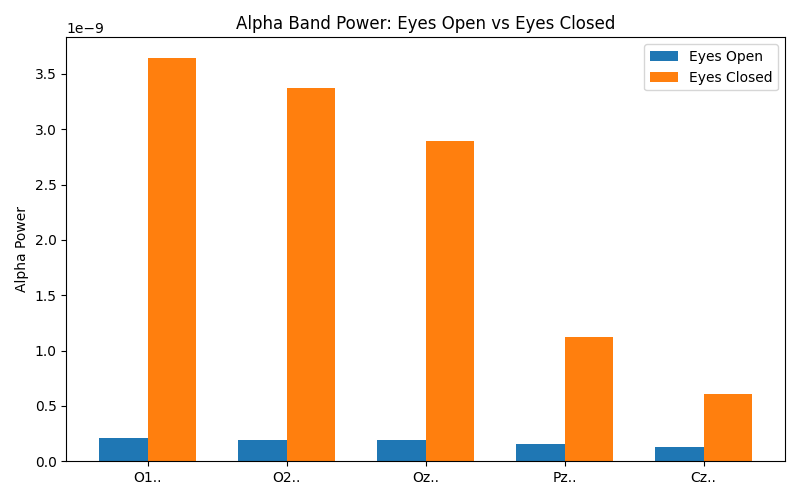

## 🧠 EEG Preprocessing & Alpha Band Analysis

 
 
 


```
This repository is part of my journey to learn and explore EEG (Electroencephalography) signal processing.
The goal was to build a simple yet effective pipeline to clean, visualize, and analyze raw EEG data.

The first target: observe alpha band (8–12 Hz) differences in occipital channels (O1, O2, Oz) under eyes-open vs. eyes-closed conditions.
✔️ Achieved: alpha power increased more than 15× with eyes closed — exactly as reported in EEG literature 🚀
```
---

## 🎯 Objectives
```
- Learning-oriented: build an EEG preprocessing pipeline from scratch.
- Simple but powerful: include bandpass, notch filter, PSD, and band power computation.
- Scientific validation: replicate the classical finding (eyes closed → alpha increase).
```
---

## 📂 Project Structure
```
EEG_Project/
│
├── data/                       # .edf files (example: PhysioNet EEGMMI)
├── src/                        # source modules
│   ├── preprocessing.py        # bandpass & notch filters
│   ├── visualization.py        # time & frequency plots
│   └── features.py             # band power calculations
├── results/                    # saved figures
│   └── alpha_compare.png
├── main.py                     # basic pipeline (single channel demo)
└── compare_alpha_multi.py      # multi-channel eyes-open vs eyes-closed
```


## 🖥️ Installation
```bash
git clone https://github.com/<username>/EEG_Project.git
cd EEG_Project
python -m venv .venv
.venv\Scripts\activate   # (Windows)
pip install -r requirements.txt

```

## ▶️ Usage

1. Run the basic pipeline:

```bash
python main.py
```

Loads raw EEG, applies filters, and generates time/frequency plots.

2. Compare alpha power (multi-channel):

```bash
python compare_alpha_multi.py
```

## 📊 Example Result
```
In occipital channels (O1, O2, Oz), alpha power increased 15–17× in eyes-closed condition compared to eyes-open.
This reproduces one of the most classical findings in EEG research.
```


| Channel | Eyes Open (α power) | Eyes Closed (α power) | Ratio (Closed/Open) |
|-------|----------------------|------------------------|----------------------|
| O1..  | 2.10e-10             | 3.65e-09               | 17.37x              |
| O2..  | 1.92e-10             | 3.37e-09               | 17.57x              |
| Oz..  | 1.87e-10             | 2.89e-09               | 15.39x              |
| Pz..  | 1.58e-10             | 1.12e-09               | 7.10x               |
| Cz..  | 1.33e-10             | 6.11e-10               | 4.59x               |

## 📚 Insights
```
- Why preprocessing matters?
Raw EEG contains lots of noise (electrical interference, eye blinks, drifts).
Applying bandpass and notch filters is essential for meaningful analysis.

- Time vs. frequency domain
EEG looks chaotic in time domain, but PSD reveals clear frequency band structure.

- Alpha band validation
Observing the eyes-open/closed alpha difference with my own pipeline was a strong motivation boost.
```

## 📦 Dependencies
```
- Python 3.9+ recommended
- NumPy
- SciPy
- Matplotlib
- MNE 
```

Install:
```bash
pip install -r requirements.txt
```

## ✨ Roadmap
```
- Implement artifact detection (e.g. eye blinks in frontal channels)
- Multi-channel topomap (visualize brain activity spatially)
- Simple ML-based classifier (e.g. motor imagery)
```

## 📚 References
```
- PhysioNet EEG Motor Movement/Imagery Dataset
- Niedermeyer’s Electroencephalography: Basic Principles, Clinical Applications, and Related Fields
- MNE-Python Documentation
```
---


## 📄 License

This project is licensed under the MIT License - see the [LICENSE](LICENSE) file for details.
